# Sound

This document outlines the architecture, data flow, and components of the audio-related ("sound") codebase in this project. The system is designed to capture audio from a selected input device, process it, and provide data for various visualizations.

## Core Concepts

The sound module revolves around several key concepts:

1.  **AudioContext Management**: The global Web Audio API `AudioContext` is managed via `SoundContext`, making it available throughout the sound-related parts of the application. This context also handles the lifecycle (status: idle, active, suspended, error) of the audio processing.
2.  **Device Handling**: `useSoundDevices` hook is responsible for enumerating available audio input devices and managing user selection.
3.  **Stream Processing**: `useSoundDeviceStream` hook takes the selected device ID and establishes a `MediaStream`. It then creates an `AnalyserNode` to extract data like waveform and frequency information.
4.  **Feature Extraction**:
    *   `useWaveformData` and `useFrequencyData` provide functions to get raw time-domain (waveform) and frequency-domain data from the `AnalyserNode`.
    *   `useMeyda` hook integrates the Meyda.js library to extract higher-level audio features like chroma, energy, and RMS from the audio stream.
5.  **Visualization**: Components like `Waveform` and `Chroma` consume the processed data to render visual feedback.

## Modules & Data Flow

### 1. Types (`lib/types/sound.ts`)

Defines essential TypeScript types used across the sound module:
*   `SoundStatus`: Represents the lifecycle state of the `AudioContext`.
*   `SoundDevicesData`: Structure for device list and selection.
*   `SoundContextValue`: Shape of the data provided by `SoundContext`.
*   `SoundStreamData`: Structure for stream, analyser, and initialization status.
*   `VisualizerProps`: Common props for visualizer components.
*   `SoundError`: Defines the shape of error objects.

### 2. Context (`contexts/sound-context.tsx`)

*   **`SoundContextProvider`**:
    *   Manages a singleton `AudioContext` instance.
    *   **State**:
        *   `audioContext: AudioContext | null`: The Web Audio API AudioContext.
        *   `status: SoundStatus`: Current status of the audio context (e.g., "idle", "active", "error").
        *   `error: SoundError | null`: Any error that occurred during audio operations.
    *   **Functions**: Provides `initialize`, `suspend`, and `resume` methods to control the `AudioContext`.
    *   **Initialization**: Attempts to initialize or resume the `AudioContext` on mount and listens to its state changes.
*   **`useSoundContext`**: Custom hook to easily consume the `SoundContextValue`.

### 3. Hooks (`hooks/sound/`)

*   **`useSoundDevices()`**:
    *   **Purpose**: Fetches and manages audio input devices.
    *   **State**:
        *   `devices: MediaDeviceInfo[]`: List of available audio input devices.
        *   `selectedDevice: string`: ID of the currently selected device.
    *   **Functionality**: Uses `navigator.mediaDevices.enumerateDevices()` to get devices. Sets the first available audio input as default. Provides `setSelectedDevice` to change selection. Listens for `devicechange` events to update the list.
*   **`useSoundDeviceStream(deviceId: string)`**:
    *   **Purpose**: Creates and manages the `MediaStream` and `AnalyserNode` for the selected device.
    *   **Dependencies**: `deviceId` (from `useSoundDevices`), `audioContext`, `status` (from `useSoundContext`).
    *   **State & Refs**:
        *   `isInitialized: boolean`: True if the stream and analyser are set up.
        *   `analyserRef: AnalyserNode | null`
        *   `sourceRef: MediaStreamAudioSourceNode | null`
        *   `streamRef: MediaStream | null`
    *   **Functionality**:
        1.  When `deviceId` and active `audioContext` are available, it cleans up any existing stream/analyser.
        2.  Requests microphone access for the `deviceId` using `navigator.mediaDevices.getUserMedia()`.
        3.  Creates an `AnalyserNode` from the `audioContext`.
        4.  Creates a `MediaStreamAudioSourceNode` from the stream and connects it to the `analyser`.
        5.  Handles cleanup (stopping tracks, disconnecting nodes) on unmount or when `deviceId` changes.
    *   **Returns**: `{ stream, analyser, isInitialized }`.
*   **`useFrequencyData(analyser: AnalyserNode | null, isInitialized: boolean)`**:
    *   **Purpose**: Provides a function to get byte frequency data from an `AnalyserNode`.
    *   **Functionality**: Returns `getFrequencyData()`. When called, if `isInitialized` and `analyser` are valid, it calls `analyser.getByteFrequencyData()` to fill a `Uint8Array`.
*   **`useWaveformData(analyser: AnalyserNode | null, isInitialized: boolean)`**:
    *   **Purpose**: Provides a function to get byte time-domain (waveform) data.
    *   **Functionality**: Similar to `useFrequencyData`, but calls `analyser.getByteTimeDomainData()`.
*   **`useMeyda(context: AudioContext | null, stream: MediaStream | null)`**:
    *   **Purpose**: Integrates Meyda.js for advanced audio feature extraction.
    *   **Dependencies**: `AudioContext` instance, `MediaStream`.
    *   **State**:
        *   `features: MeydaFeaturesObject | null`: The extracted audio features (e.g., chroma, RMS, energy).
        *   `meydaInitializing: boolean`: True while Meyda is setting up.
        *   `meydaError: Error | null`: Any error from Meyda.
    *   **Functionality**: When `context` and `stream` are available, it creates a Meyda analyser instance, connects it to the stream source, starts it, and updates the `features` state via a callback. Handles cleanup.

### 4. Components (`components/sound/`)

*   **`SoundBlock.tsx`**:
    *   **Purpose**: The main UI component that orchestrates the sound visualization.
    *   **Functionality**:
        1.  Uses `useSoundContext()` to access the `audioContext`.
        2.  Uses `useSoundDevices()` for device selection logic.
        3.  Uses `useSoundDeviceStream()` to get the `stream` and `analyser` based on the selected device.
        4.  Uses `useMeyda()` with the `audioContext` and `stream` to get `features`.
        5.  Manages `activeVisualizers` state (e.g., ["waveform", "chroma"]) to control which visualizations are displayed.
        6.  Passes `analyser` and `isInitialized` to `Waveform`.
        7.  Passes `features.chroma` (if available) to `Chroma`.
        8.  Renders `SoundDevices` component for device selection.
        9.  Displays status badges (loading, active, error) based on hook states.
*   **`SoundDevices.tsx`**:
    *   **Purpose**: UI for selecting an audio input device.
    *   **Props**: `devices`, `selectedDeviceId`, `onDeviceChange`.
    *   **Functionality**: Renders a `Select` dropdown with the list of devices and a badge showing the count.
*   **`Waveform.tsx`**:
    *   **Purpose**: Renders a real-time waveform visualization on a `<canvas>`.
    *   **Props**: `analyser`, `isInitialized`, `backgroundColor`, `lineColor`.
    *   **Functionality**: Uses `useWaveformData()` to get data. Employs `requestAnimationFrame` for smooth animation. Sets up canvas dimensions and drawing styles. Includes a `WaveformSkeleton` for fallback.
*   **`Chroma.tsx`**:
    *   **Purpose**: Visualizes chroma (pitch class) data.
    *   **Props**: `data` (array of chroma values from Meyda).
    *   **Functionality**: Normalizes the input data. Renders 12 bars (C, C#, D, ...B), with each bar\'s appearance (e.g., background color intensity) corresponding to the intensity of that pitch class. Uses `React.memo` and custom equality checks for performance.
*   **`FrequencyBars.tsx`**:
    *   **Purpose**: (Conceptual, used in 3D scenes) Renders frequency data as a series of bars using React Three Fiber.
    *   **Props**: `analyser`, `isInitialized`.
    *   **Functionality**: Uses `useFrequencyData()`. Updates an `InstancedMesh` in a `useFrame` loop, where each instance represents a frequency bin.

### 5. Page (`app/sound/wave-lab/page.tsx`)

*   **Purpose**: Entry point for the `/sound/wave-lab` route.
*   **Functionality**:
    1.  Wraps the `SoundBlock` component with `SoundContextProvider` to make the sound context available.
    2.  Uses `Suspense` for fallback UI during loading.
    3.  Contains TODOs for renaming `SoundBlock` to `WaveLab` and further refactoring.

## Data Flow Diagram

```mermaid
graph TD
    subgraph Page["app/sound/wave-lab/page.tsx"]
        WaveLabPage[WaveLabPage]
    end

    subgraph Context["contexts/sound-context.tsx"]
        SoundCtxProvider[SoundContextProvider]
        SoundCtxVal["SoundContextValue (audioContext, status, error)"]
        useSoundCtx[useSoundContext]
    end

    subgraph LibTypes["lib/types/sound.ts"]
        SoundTsTypes["Sound/* Types"]
    end

    subgraph Hooks["hooks/sound/*"]
        HookSoundDevices[useSoundDevices]
        HookSoundDeviceStream[useSoundDeviceStream]
        HookMeyda[useMeyda]
        HookWaveformData[useWaveformData]
        HookFrequencyData[useFrequencyData]
    end

    subgraph Components["components/sound/*"]
        CompSoundBlock[SoundBlock]
        CompSoundDevices[SoundDevices]
        CompWaveform[Waveform]
        CompChroma[Chroma]
    end

    subgraph BrowserAPI["Browser Web Audio / MediaDevices API"]
        MediaDevicesAPI["navigator.mediaDevices"]
        AudioContextAPI["AudioContext API"]
    end

    subgraph ExternalLibs["External Libraries"]
        MeydaJS["Meyda.js"]
    end

    %% Page & Context Setup
    WaveLabPage -- hosts --> SoundCtxProvider;
    SoundCtxProvider -- creates & manages --> AudioContextAPI;
    SoundCtxProvider -- provides --> SoundCtxVal;

    %% SoundBlock Orchestration
    CompSoundBlock -- consumes --> useSoundCtx;
    CompSoundBlock -- uses --> HookSoundDevices;
    CompSoundBlock -- uses --> HookSoundDeviceStream;
    CompSoundBlock -- uses --> HookMeyda;

    %% Hook Interactions & Dependencies
    HookSoundDevices -- interacts with --> MediaDevicesAPI;
    HookSoundDevices -- returns --> DeviceInfo["devices, selectedDevice, setSelectedDevice"];
    CompSoundBlock -- receives --> DeviceInfo;

    HookSoundDeviceStream -- takes --> DeviceInfo["selectedDevice"];
    HookSoundDeviceStream -- uses --> SoundCtxVal["audioContext, status"];
    HookSoundDeviceStream -- interacts with --> MediaDevicesAPI;
    HookSoundDeviceStream -- interacts with --> AudioContextAPI["AnalyserNode"];
    HookSoundDeviceStream -- returns --> StreamAnalyserInfo["stream, analyser, isInitialized"];
    CompSoundBlock -- receives --> StreamAnalyserInfo;

    HookMeyda -- uses --> SoundCtxVal["audioContext"];
    HookMeyda -- takes --> StreamAnalyserInfo["stream"];
    HookMeyda -- uses --> MeydaJS;
    HookMeyda -- returns --> MeydaFeatures["features (chroma, etc.)"];
    CompSoundBlock -- receives --> MeydaFeatures;

    %% Component Data Consumption
    CompSoundBlock -- passes props to --> CompSoundDevices;
    CompSoundBlock -- passes (analyser, isInitialized) to --> CompWaveform;
    CompSoundBlock -- passes (chroma data) to --> CompChroma;

    CompWaveform -- uses --> HookWaveformData;
    HookWaveformData -- takes --> StreamAnalyserInfo["analyser, isInitialized"];
    HookWaveformData -- interacts with --> AudioContextAPI["AnalyserNode.getByteTimeDomainData()"];

    %% Type Usage
    SoundCtxProvider --> SoundTsTypes;
    HookSoundDevices --> SoundTsTypes;
    HookSoundDeviceStream --> SoundTsTypes;
    HookMeyda --> SoundTsTypes;
    CompWaveform --> SoundTsTypes;

    %% Style
    style WaveLabPage fill:#D6EAF8
    style SoundCtxProvider fill:#D6EAF8
    style CompSoundBlock fill:#E8DAEF
    style HookSoundDevices fill:#D5F5E3
    style HookSoundDeviceStream fill:#D5F5E3
    style HookMeyda fill:#D5F5E3
    style CompWaveform fill:#FDEDEC
    style CompChroma fill:#FDEDEC
    style CompSoundDevices fill:#FDEDEC
```



## React Compiler Notes

This project utilizes React Compiler. The compiler aims to automatically optimize React components and hooks by memoizing values and skipping unnecessary re-renders. This can reduce the need for manual memoization techniques like `useMemo`, `useCallback`, and `React.memo`. While these manual techniques are still present in some parts of the codebase (e.g., `Chroma.tsx`, `Waveform.tsx`), they might become candidates for simplification if the compiler proves to handle these cases effectively. It\'s recommended to profile and verify compiler optimizations before removing manual memoization.

## Suggested Improvements & Refactors

1.  **`AudioContext` Encapsulation in `SoundContext`**:
    *   **Issue**: `SoundContextProvider` uses a top-level `globalAudioContext` variable and a `getAudioContext` helper. This makes the `AudioContext` instance accessible outside the React lifecycle and context provider.
    *   **Suggestion**: Refactor `SoundContextProvider` to create and manage the `AudioContext` instance strictly within its own state (e.g., using `useState` with an initializer function or `useRef`). This aligns better with React component patterns and encapsulation.

2.  **`useSoundDeviceStream` Cleanup Logic**:
    *   **Issue**: The hook uses a `cleanupRef` and a separate `useEffect` (lines 32-39) to manage the `cleanup` function reference.
    *   **Suggestion**: Since the `cleanup` function is memoized with `useCallback(..., [])`, it has a stable reference. The separate `useEffect` and `cleanupRef` might be redundant. The main `useEffect` (lines 41-105) can directly return the stable `cleanup` function for its teardown. This would simplify the hook.
        ```typescript
        // In useSoundDeviceStream.ts
        const cleanup = useCallback(() => {
          // ... existing cleanup logic ...
        }, []);

        useEffect(() => {
          // ... existing initialization logic ...
          async function initializeSound() { /* ... */ }

          if (status === "active" || status === "suspended") {
            initializeSound();
          }

          return () => { // This is the main effect's cleanup
            mounted = false;
            cleanup(); // Call the stable cleanup function directly
          };
        }, [deviceId, audioContext, status, initialize, cleanup]); // Keep cleanup in deps

        // Remove the other useEffect that sets cleanupRef
        ```

3.  **Enhanced UI Error Reporting**:
    *   **Issue**: `SoundBlock` displays generic "error" status.
    *   **Suggestion**: Modify `SoundBlock` and potentially `SoundContext` to propagate and display more specific error messages derived from `SoundError.message` or `meydaError.message` to provide better user feedback.

4.  **Completing TODOs**:
    *   Address the TODOs in `app/sound/wave-lab/page.tsx` (e.g., renaming `SoundBlock` to `WaveLab`).

5.  **Component-Level Testing**:
    *   **Suggestion**: While hooks are well-tested, consider adding integration tests for `SoundBlock.tsx` using React Testing Library. These tests could mock the custom hooks to verify that `SoundBlock` correctly orchestrates them and passes appropriate data to its child visualizer components based on different states (loading, active, error, device changes).

## Testing Notes

The sound module has a good foundation of unit tests for its custom hooks and the `SoundContext` using Vitest and React Testing Library. Mocks for browser APIs (`AudioContext`, `navigator.mediaDevices`) are effectively implemented. Further testing could focus on component interactions as suggested above.

## Other Notes

*   The use of specific audio constraints in `useSoundDeviceStream` (disabling echo cancellation, noise suppression, auto gain control) is good for analysis tasks as it provides a cleaner audio signal.
*   The performance optimizations in `Chroma.tsx` (using `React.memo` with custom equality checks) and `Waveform.tsx` (using `useCallback`, `requestAnimationFrame`, and canvas best practices) are well-implemented. With React Compiler, the necessity of manual memoization should be re-evaluated over time.
