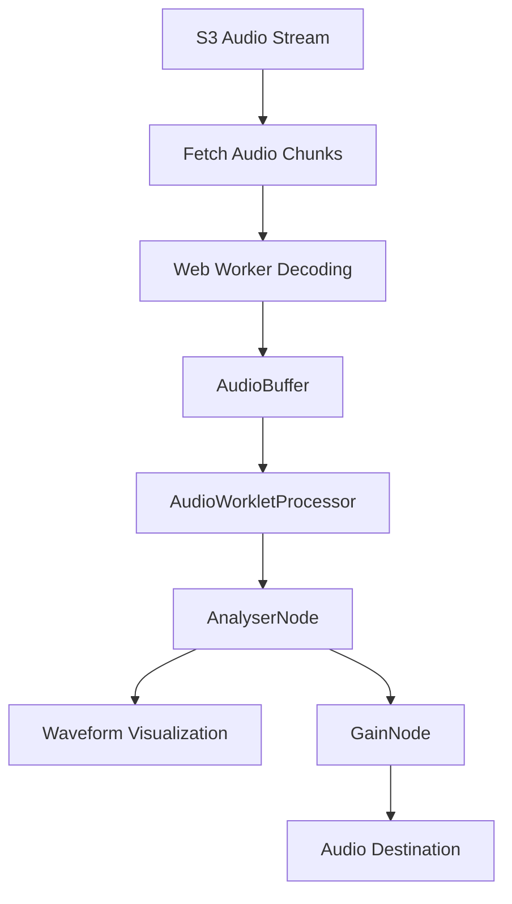

# WavePlayer - DeepSeek R1 Report

## Thinking

```plaintext
<think>
Okay, let's start by incorporating the user's answers into the existing plan. The user wants to prioritize waveform display initially but plans to add frequency analysis later. They prefer streaming from S3 but need real-time analysis, so I need to balance streaming efficiency with precise audio data access.

First, considering the initial focus on waveform, using canvas with the AnalyserNode's time-domain data makes sense. But since they want React Three Fiber later, maybe set up a flexible visualization system from the start.

For audio streaming, MediaElementSource might not provide the precise control needed for real-time analysis. Using AudioBufferSourceNode with chunked loading could be better, even though it requires more memory. Alternatively, implement a hybrid approach where the initial buffer is loaded for immediate playback while streaming the rest.

The user doesn't need crossfading or offline support initially, so those can be deprioritized. The core audio engine should focus on reliable playback, accurate seeking, and real-time waveform data.

State management needs to handle track loading, playback status, and visualization data without causing excessive re-renders. Using useReducer with context might help centralize state while optimizing updates.

For the audio pipeline, ensure that the Worklet is set up even for the initial waveform to offload processing. This prepares for future frequency analysis without complicating the initial setup.

Error handling should cover network issues during audio fetching and decoding. Implementing retries and progress indicators will enhance user experience.

Finally, structuring the components to separate concerns: a core audio context provider, hooks for state and controls, and visualization components that can be swapped between canvas and WebGL later.
</think>
```

## Revised Architecture Plan

### Core Audio Pipeline



### Key Implementation Strategies

1. **Hybrid Streaming Approach**

```typescript
// Initial implementation using buffered playback
const loadAudioBuffer = async (url: string) => {
  const response = await fetch(url);
  const arrayBuffer = await response.arrayBuffer();
  return await audioContext.decodeAudioData(arrayBuffer);
};

// Future streaming extension
const createMediaElementSource = (url: string) => {
  const audioElement = new Audio(url);
  return audioContext.createMediaElementSource(audioElement);
};
```

2. **State Management Structure**

```typescript
// Core state shape
type WavePlayerState = {
  status: "idle" | "loading" | "ready" | "playing" | "paused";
  currentTrack: WavePlayerTrack | null;
  buffer: AudioBuffer | null;
  playbackPosition: number;
  volume: number;
  waveformData: Uint8Array | null;
  visualizationMode: "waveform" | "frequency";
};

// Optimized state updates using useReducer
const [state, dispatch] = useReducer(playerReducer, initialState);

// Context provider optimization
const memoizedValue = useMemo(() => ({ state, controls }), [state, controls]);
```

3. **Visualization System**

```tsx
// WaveformCanvas.tsx
const WaveformCanvas = ({ data }: { data: Uint8Array }) => {
  const canvasRef = useRef<HTMLCanvasElement>(null);

  useEffect(() => {
    const ctx = canvasRef.current?.getContext('2d');
    if (!ctx) return;
    
    // Draw waveform using canvas API
    ctx.clearRect(0, 0, ctx.canvas.width, ctx.canvas.height);
    ctx.beginPath();
    data.forEach((value, i) => {
      const x = (i / data.length) * ctx.canvas.width;
      const y = (value / 255) * ctx.canvas.height;
      ctx.lineTo(x, y);
    });
    ctx.stroke();
  }, [data]);

  return <canvas ref={canvasRef} className="w-full h-32" />;
};
```

4. **Optimized Audio Workflow**

```typescript
// Audio processing workflow
const initializePlayback = async (buffer: AudioBuffer) => {
  const source = audioContext.createBufferSource();
  source.buffer = buffer;
  
  const analyser = audioContext.createAnalyser();
  analyser.fftSize = 2048;
  
  const gain = audioContext.createGain();
  gain.gain.value = state.volume;

  source.connect(analyser);
  analyser.connect(gain);
  gain.connect(audioContext.destination);

  // Visualization update loop
  const updateWaveform = () => {
    const dataArray = new Uint8Array(analyser.frequencyBinCount);
    analyser.getByteTimeDomainData(dataArray);
    dispatch({ type: 'UPDATE_WAVEFORM', payload: dataArray });
    requestAnimationFrame(updateWaveform);
  };

  source.start(0, state.playbackPosition);
  updateWaveform();
  
  return source;
};
```

## Implementation Priorities

### Phase 1: Core Functionality (2 Weeks)

1. **Audio Context Management**
   - Safe context initialization/resumption
   - Autoplay policy handling
   - Device audio output management

2. **Track Loading & Playback**
   - Chunked audio loading from S3
   - Web Worker decoding
   - Precise playback controls

3. **Waveform Visualization**
   - Canvas-based rendering
   - 60fps update loop
   - Responsive scaling

4. **State Management**
   - Reducer-based state machine
   - Memoized context values
   - Error recovery system

```typescript
// Example reducer action
case 'PLAY':
  if (state.status !== 'ready') return state;
  return {
    ...state,
    status: 'playing',
    sourceNode: action.payload,
    startTime: audioContext.currentTime - state.playbackPosition
  };
```

### Phase 2: Advanced Features (1 Week)

1. **React Three Fiber Integration**
   - GLSL shader setup
   - Frequency data visualization
   - Animation system

2. **Performance Optimizations**
   - Double buffering for visualization
   - Audio chunk preloading
   - Memory management

3. **Enhanced Controls**
   - Frame-accurate seeking
   - Playback rate adjustment
   - Lossless audio support

## Critical Path Implementation Details

1. **Audio Worklet Integration**

```javascript
// worklet-processor.js
class WaveformProcessor extends AudioWorkletProcessor {
  process(inputs) {
    const input = inputs[0];
    if (input.length > 0) {
      this.port.postMessage(input[0]);
    }
    return true;
  }
}
registerProcessor('waveform-processor', WaveformProcessor);
```

2. **Precise Playback Control**

```typescript
const controls = {
  seek: (time: number) => {
    if (!state.sourceNode || !audioContext) return;
    
    state.sourceNode.stop();
    const newSource = audioContext.createBufferSource();
    newSource.buffer = state.buffer;
    newSource.connect(analyserNode);
    
    newSource.start(0, time);
    dispatch({
      type: 'SEEK',
      payload: {
        sourceNode: newSource,
        playbackPosition: time
      }
    });
  }
};
```

3. **Visualization Optimization**

```typescript
// Throttled visualization updates
const visualizationWorker = new Worker('visualization.worker.js');

analyserNode.onaudioprocess = () => {
  const data = new Float32Array(analyserNode.fftSize);
  analyserNode.getFloatTimeDomainData(data);
  visualizationWorker.postMessage(data);
};
```

Would you like me to provide specific component implementations or dive deeper into any particular aspect?
