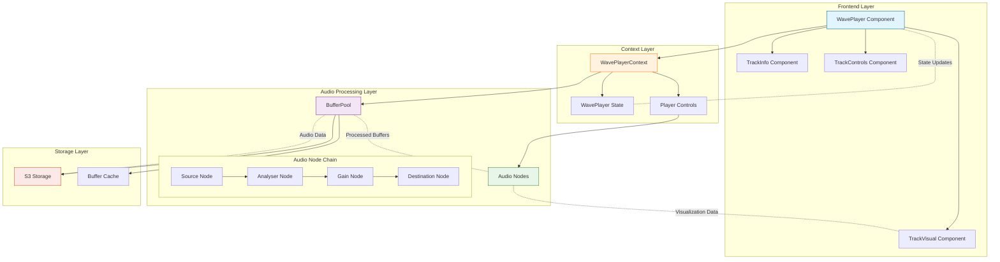
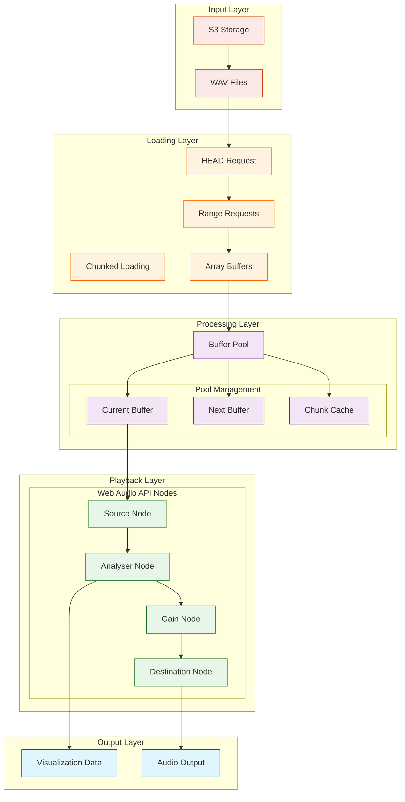

# WavePlayer Diagrams

## System Architecture

```mermaid
graph TB
    subgraph Frontend["Frontend Layer"]
        WP[WavePlayer Component]
        TI[TrackInfo Component]
        TV[TrackVisual Component]
        TC[TrackControls Component]
    end

    subgraph Context["Context Layer"]
        WPC[WavePlayerContext]
        WPS[WavePlayer State]
        Controls[Player Controls]
    end

    subgraph Audio["Audio Processing Layer"]
        BP[BufferPool]
        AN[Audio Nodes]
        subgraph Nodes["Audio Node Chain"]
            SN[Source Node]
            ANN[Analyser Node]
            GN[Gain Node]
            DN[Destination Node]
        end
    end

    subgraph Storage["Storage Layer"]
        S3[S3 Storage]
        Cache[Buffer Cache]
    end

    %% Component Connections
    WP --> TI & TV & TC
    WP --> WPC
    WPC --> WPS
    WPC --> Controls
    Controls --> AN
    WPC --> BP
    BP --> Cache
    BP --> S3
    
    %% Audio Node Chain
    SN --> ANN
    ANN --> GN
    GN --> DN

    %% Data Flow
    S3 -.- |Audio Data| BP
    BP -.- |Processed Buffers| AN
    AN -.- |Visualization Data| TV
    WPS -.- |State Updates| WP

    style WP fill:#e1f5fe,stroke:#01579b
    style WPC fill:#fff3e0,stroke:#ff6f00
    style BP fill:#f3e5f5,stroke:#7b1fa2
    style AN fill:#e8f5e9,stroke:#2e7d32
    style S3 fill:#fbe9e7,stroke:#d84315
```

## Audio Data Flow

```mermaid
flowchart TB
    subgraph Input["Input Layer"]
        S3[S3 Storage]
        WAV[WAV Files]
        S3 --> WAV
    end

    subgraph Loading["Loading Layer"]
        CL[Chunked Loading]
        HEAD[HEAD Request]
        RANGE[Range Requests]
        AB[Array Buffers]
        
        WAV --> HEAD
        HEAD --> RANGE
        RANGE --> AB
    end

    subgraph Processing["Processing Layer"]
        BP[Buffer Pool]
        subgraph Pool["Pool Management"]
            CB[Current Buffer]
            NB[Next Buffer]
            CH[Chunk Cache]
        end
        
        AB --> BP
        BP --> CB & NB & CH
    end

    subgraph Playback["Playback Layer"]
        subgraph Nodes["Web Audio API Nodes"]
            SRC[Source Node]
            ANA[Analyser Node]
            GAIN[Gain Node]
            DEST[Destination Node]
        end
        
        CB --> SRC
        SRC --> ANA
        ANA --> GAIN
        GAIN --> DEST
    end

    subgraph Output["Output Layer"]
        VIS[Visualization Data]
        AUDIO[Audio Output]
        
        ANA --> VIS
        DEST --> AUDIO
    end

    %% Styling
    classDef storage fill:#fbe9e7,stroke:#d84315
    classDef loading fill:#fff3e0,stroke:#ff6f00
    classDef processing fill:#f3e5f5,stroke:#7b1fa2
    classDef playback fill:#e8f5e9,stroke:#2e7d32
    classDef output fill:#e1f5fe,stroke:#01579b

    class S3,WAV storage
    class CL,HEAD,RANGE,AB loading
    class BP,CB,NB,CH processing
    class SRC,ANA,GAIN,DEST playback
    class VIS,AUDIO output
```
