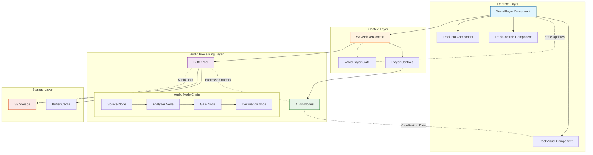
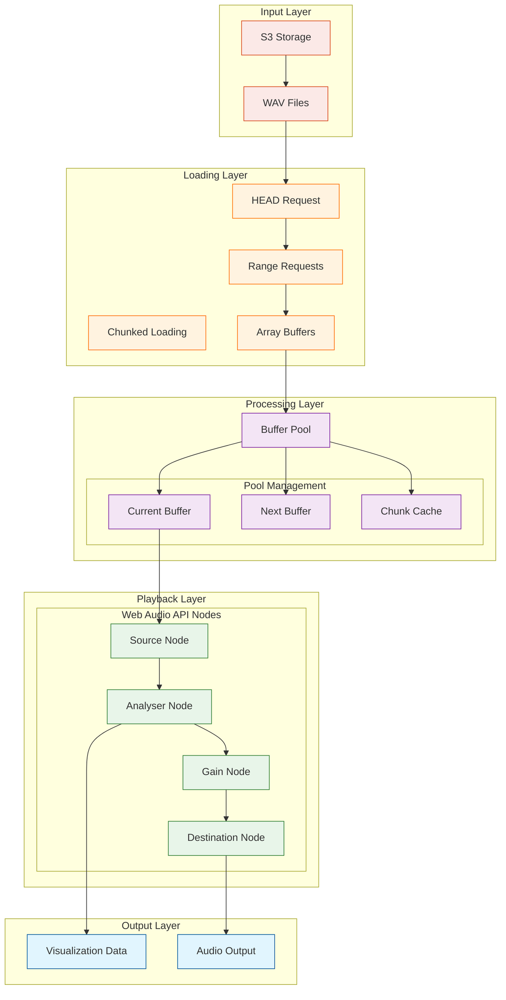
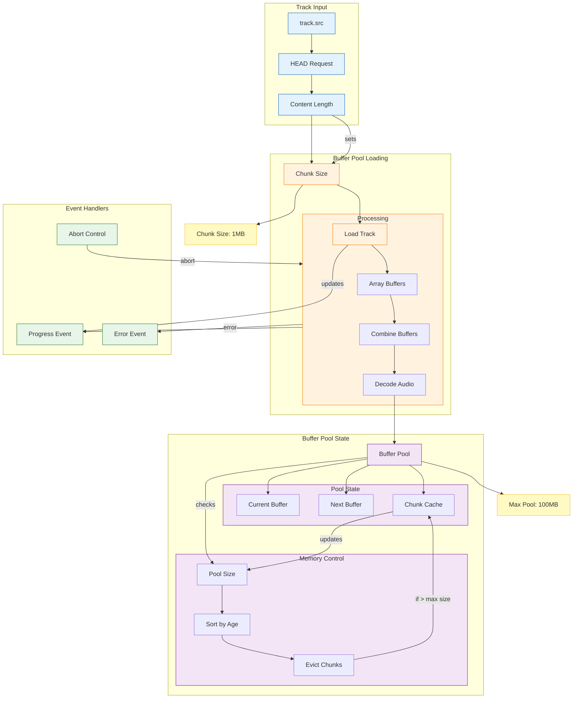

# WavePlayer Diagrams

## System Architecture

```mermaid
graph TB
    subgraph Frontend["Frontend Layer"]
        WP[WavePlayer Component]
        TI[TrackInfo Component]
        TV[TrackVisual Component]
        TC[TrackControls Component]
    end

    subgraph Context["Context Layer"]
        WPC[WavePlayerContext]
        WPS[WavePlayer State]
        Controls[Player Controls]
    end

    subgraph Audio["Audio Processing Layer"]
        BP[BufferPool]
        AN[Audio Nodes]
        subgraph Nodes["Audio Node Chain"]
            SN[Source Node]
            ANN[Analyser Node]
            GN[Gain Node]
            DN[Destination Node]
        end
    end

    subgraph Storage["Storage Layer"]
        S3[S3 Storage]
        Cache[Buffer Cache]
    end

    %% Component Connections
    WP --> TI & TV & TC
    WP --> WPC
    WPC --> WPS
    WPC --> Controls
    Controls --> AN
    WPC --> BP
    BP --> Cache
    BP --> S3
    
    %% Audio Node Chain
    SN --> ANN
    ANN --> GN
    GN --> DN

    %% Data Flow
    S3 -.- |Audio Data| BP
    BP -.- |Processed Buffers| AN
    AN -.- |Visualization Data| TV
    WPS -.- |State Updates| WP

    style WP fill:#e1f5fe,stroke:#01579b
    style WPC fill:#fff3e0,stroke:#ff6f00
    style BP fill:#f3e5f5,stroke:#7b1fa2
    style AN fill:#e8f5e9,stroke:#2e7d32
    style S3 fill:#fbe9e7,stroke:#d84315
```

## Audio Data Flow

```mermaid
flowchart TB
    subgraph Input["Input Layer"]
        S3[S3 Storage]
        WAV[WAV Files]
        S3 --> WAV
    end

    subgraph Loading["Loading Layer"]
        CL[Chunked Loading]
        HEAD[HEAD Request]
        RANGE[Range Requests]
        AB[Array Buffers]
        
        WAV --> HEAD
        HEAD --> RANGE
        RANGE --> AB
    end

    subgraph Processing["Processing Layer"]
        BP[Buffer Pool]
        subgraph Pool["Pool Management"]
            CB[Current Buffer]
            NB[Next Buffer]
            CH[Chunk Cache]
        end
        
        AB --> BP
        BP --> CB & NB & CH
    end

    subgraph Playback["Playback Layer"]
        subgraph Nodes["Web Audio API Nodes"]
            SRC[Source Node]
            ANA[Analyser Node]
            GAIN[Gain Node]
            DEST[Destination Node]
        end
        
        CB --> SRC
        SRC --> ANA
        ANA --> GAIN
        GAIN --> DEST
    end

    subgraph Output["Output Layer"]
        VIS[Visualization Data]
        AUDIO[Audio Output]
        
        ANA --> VIS
        DEST --> AUDIO
    end

    %% Styling
    classDef storage fill:#fbe9e7,stroke:#d84315
    classDef loading fill:#fff3e0,stroke:#ff6f00
    classDef processing fill:#f3e5f5,stroke:#7b1fa2
    classDef playback fill:#e8f5e9,stroke:#2e7d32
    classDef output fill:#e1f5fe,stroke:#01579b

    class S3,WAV storage
    class CL,HEAD,RANGE,AB loading
    class BP,CB,NB,CH processing
    class SRC,ANA,GAIN,DEST playback
    class VIS,AUDIO output
```

## Buffer Pool System

```mermaid
graph TB
    subgraph Input["Track Input"]
        Track["track.src"]
        Track --> Head["HEAD Request"]
        Head --> Length["Content Length"]
    end

    subgraph Loading["Buffer Pool Loading"]
        Length --> CS["Chunk Size"]
        CS --> Chunks["Load Track"]
        
        subgraph Process["Processing"]
            Chunks --> AB["Array Buffers"]
            AB --> Combine["Combine Buffers"]
            Combine --> Decode["Decode Audio"]
        end
    end

    subgraph Pool["Buffer Pool State"]
        Decode --> BP["Buffer Pool"]
        
        subgraph State["Pool State"]
            Current["Current Buffer"]
            Next["Next Buffer"]
            Cache["Chunk Cache"]
        end
        
        BP --> Current
        BP --> Next
        BP --> Cache

        subgraph Memory["Memory Control"]
            Size["Pool Size"]
            Sort["Sort by Age"]
            Evict["Evict Chunks"]
            
            Size --> Sort
            Sort --> Evict
            Evict --> |"if > max size"| Cache
        end
    end

    subgraph Events["Event Handlers"]
        Progress["Progress Event"]
        Error["Error Event"]
        Abort["Abort Control"]
        
        Process --> Progress
        Process --> |"error"| Error
        Abort --> |"abort"| Process
    end

    %% Relationships
    Length --> |"sets"| CS
    Chunks --> |"updates"| Progress
    BP --> |"checks"| Size
    Cache --> |"updates"| Size

    %% Styling
    classDef input fill:#e3f2fd,stroke:#1565c0
    classDef loading fill:#fff3e0,stroke:#f57c00
    classDef pool fill:#f3e5f5,stroke:#7b1fa2
    classDef events fill:#e8f5e9,stroke:#2e7d32

    class Track,Head,Length input
    class CS,Chunks,Process loading
    class BP,State,Memory pool
    class Progress,Error,Abort events

    %% Notes
    note["Chunk Size: 1MB"]
    note2["Max Pool: 100MB"]
    CS --> note
    BP --> note2

    style note fill:#fff9c4,stroke:#fbc02d
    style note2 fill:#fff9c4,stroke:#fbc02d
```
